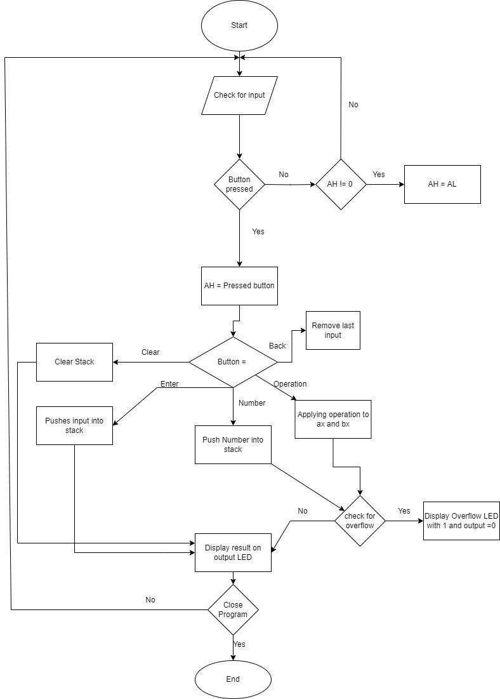
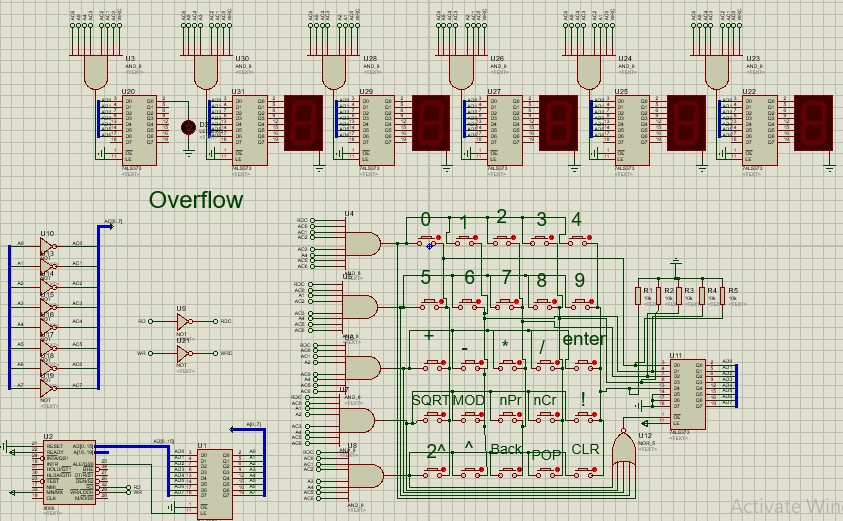
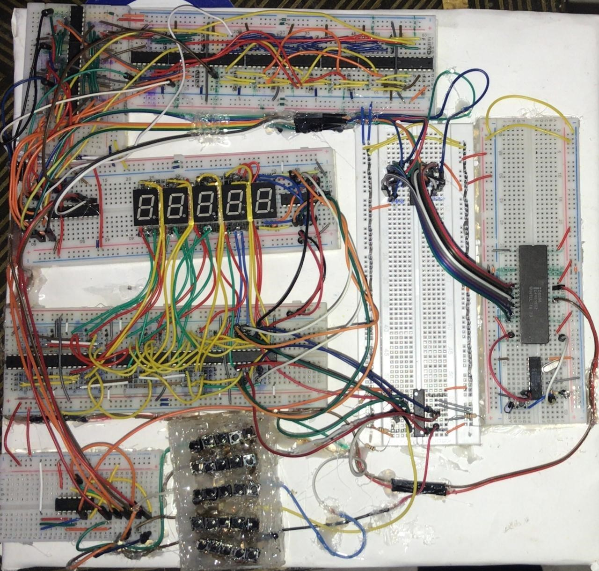

# 8086-Based Reverse Polish Notation (RPN) Calculator Using Proteus &amp; Assembly
This project implements a **Reverse Polish Notation (RPN) Calculator** using the Intel 8086 microprocessor. It supports various arithmetic operations, approximations, and control functions. The project is written in **Assembly Language** and is simulated in **Proteus** for hardware-level validation. The hardware implementation design is also included.

---

## Features

### Arithmetic Operations
- **Addition (+)**  
- **Subtraction (-)**  
- **Multiplication (×)**  
- **Division (÷)** (with approximation)  
- **Remainder (%)**  
- **Factorial (!)**
- **Square Root (√)** (with approximation)  
- **Exponentiation (x^y)**  

### Control Functions
- **Back Function**: Allows you to undo the last input.  
- **Pop Function**: Removes the top value from the stack.  
- **Clear Function**: Resets the calculator and clears the stack.  

### Additional Features
- **Overflow Indicator**: Alerts when an overflow condition occurs.  
- **No Floating-Point Support**: All operations are integer-based.  
- **Approximation**: Results of division and square root operations are rounded to the nearest integer.

---

## System Overview

### Hardware Design
- **Processor**: Intel 8086 microprocessor in minimum mode.
- **Memory**: Stack-based memory management for storing operands and intermediate results.
- **I/O Devices**:
  - **7-Segment Displays**: For displaying inputs and results.
  - **Buttons**: For operand and operator input.
  - **LED Indicators**: For signaling overflow conditions.
- **Proteus Simulation**: The circuit is designed and validated using Proteus.

### Software Design
- Written entirely in **Assembly Language** for the 8086 microprocessor.
- Implements stack-based operations for RPN, making it efficient for postfix expressions.
- Custom algorithms for factorial, exponentiation, square root, and other arithmetic operations.

---

## Screenshots
### Proteus Simulation


### Proteus Simulation


### Hardware Implementation


---

## Usage

### Setting Up the Simulation
1. **Download Proteus**:
   - Install Proteus simulation software (version 8 or higher recommended).
   
2. **Clone the Repository**:
   ```bash
   git clone https://github.com/eyadgad/8086-Based-RPN-Calculator
   ```

3. **Open the Project**:
   - Open the Proteus project file (`RPN-simulation.pdsprj`) from the repository.

4. **Load the Assembly Code**:
   - Compile the `RPN-code.asm` using any compatible assembler (e.g., MASM or TASM).
   - Load the generated `.hex` or `.bin` file into the Proteus simulation.

5. **Run the Simulation**:
   - Start the Proteus simulation to test the calculator's functionality.

### Using the Calculator
1. Input operands and operators as per RPN.
2. View results on the **7-Segment Displays**.
3. Use control functions (`Back`, `Pop`, `Clear`) for stack management.
4. Observe the **LED Indicator** for overflow alerts.

---

## File Structure

```
.
├── RPN-code.asm        # Assembly code for the RPN calculator
├── RPN-simulation.pdsprj     # Proteus project file
├── RBN_simulation.png  # Screenshot of the Proteus simulation
├── RBN_hardware_implementation.png  # hardware implementation image
├── RBN_flowchart.png  # flowchart of the project working
├── README.md                 # Project documentation
```

Contributions to improve the project are welcome. Fork the repository, create a new branch, and submit a pull request.

---

## Reference
A. M. Nematallah and A. H. M. Zaghloul, "RPN Calculator," GitHub repository, May 9, 2016. [Online]. Available: https://github.com/AhmedHosamZaghloul/RPN-calculator.
